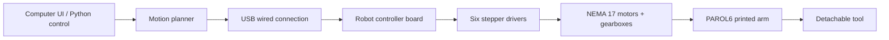
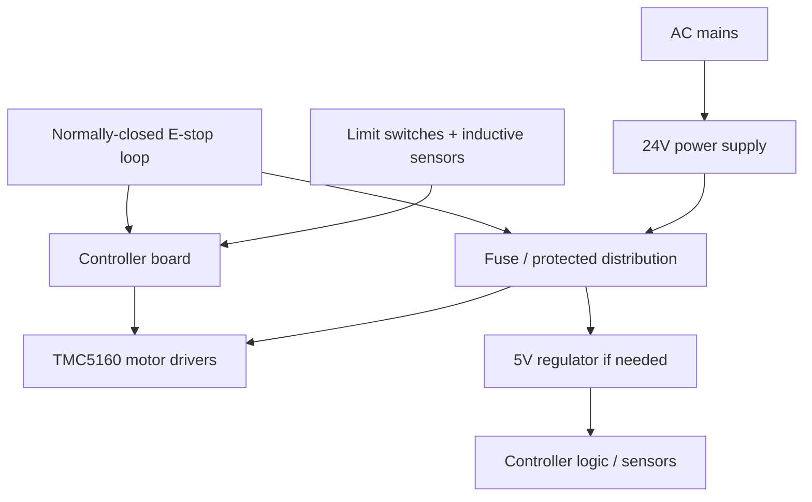
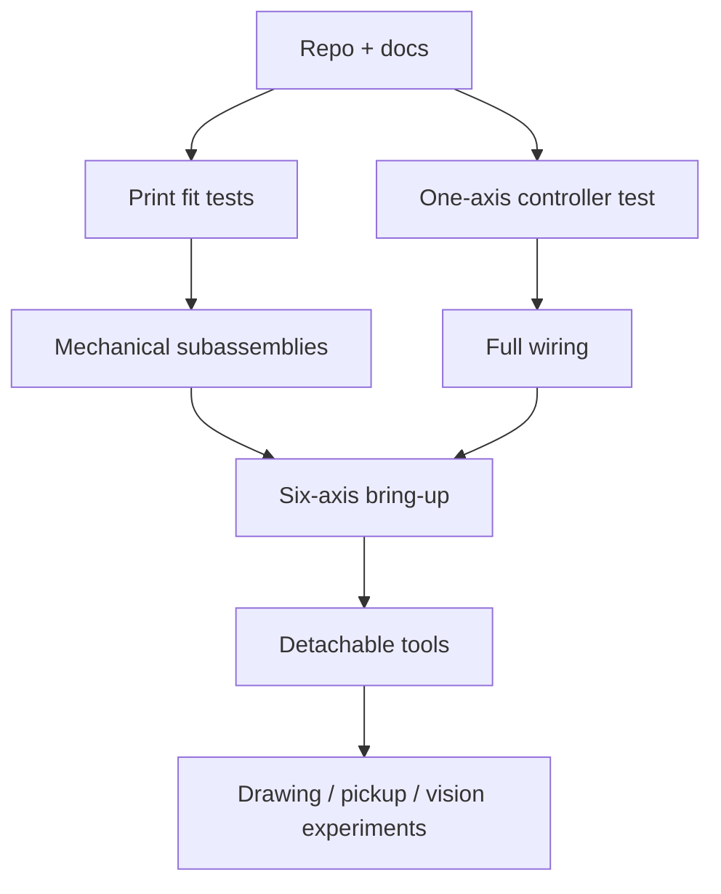
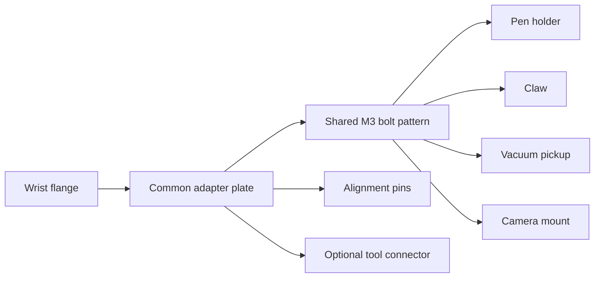

# Diagrams

## System Architecture

```mermaid
flowchart LR
  UI["Computer UI / Python control"]
  Planner["Motion planner"]
  USB["USB wired connection"]
  Controller["Robot controller board"]
  Drivers["Six stepper drivers"]
  Motors["NEMA 17 motors + gearboxes"]
  Arm["PAROL6 printed arm"]
  Tool["Detachable tool"]

  UI --> Planner --> USB --> Controller --> Drivers --> Motors --> Arm --> Tool
```

## Electrical Blocks

```mermaid
flowchart TD
  AC["AC mains"] --> PSU["24V power supply"]
  PSU --> Fuse["Fuse / protected distribution"]
  Fuse --> Drivers["TMC5160 motor drivers"]
  Fuse --> Buck["5V regulator if needed"]
  Buck --> Logic["Controller logic / sensors"]
  Controller["Controller board"] --> Drivers
  Sensors["Limit switches + inductive sensors"] --> Controller
  EStop["Normally-closed E-stop loop"] --> Controller
  EStop --> Fuse
```

## Build Dependency Graph

```mermaid
flowchart TD
  Repo["Repo + docs"] --> PrintTest["Print fit tests"]
  Repo --> ControllerTest["One-axis controller test"]
  PrintTest --> Mechanical["Mechanical subassemblies"]
  ControllerTest --> Electrical["Full wiring"]
  Mechanical --> Bringup["Six-axis bring-up"]
  Electrical --> Bringup
  Bringup --> Tooling["Detachable tools"]
  Tooling --> Experiments["Drawing / pickup / vision experiments"]
```

## Tool Changer Concept

```mermaid
flowchart LR
  Wrist["Wrist flange"] --> Plate["Common adapter plate"]
  Plate --> BoltPattern["Shared M3 bolt pattern"]
  Plate --> Pins["Alignment pins"]
  Plate --> Cable["Optional tool connector"]
  BoltPattern --> Pen["Pen holder"]
  BoltPattern --> Claw["Claw"]
  BoltPattern --> Vacuum["Vacuum pickup"]
  BoltPattern --> Camera["Camera mount"]
```
